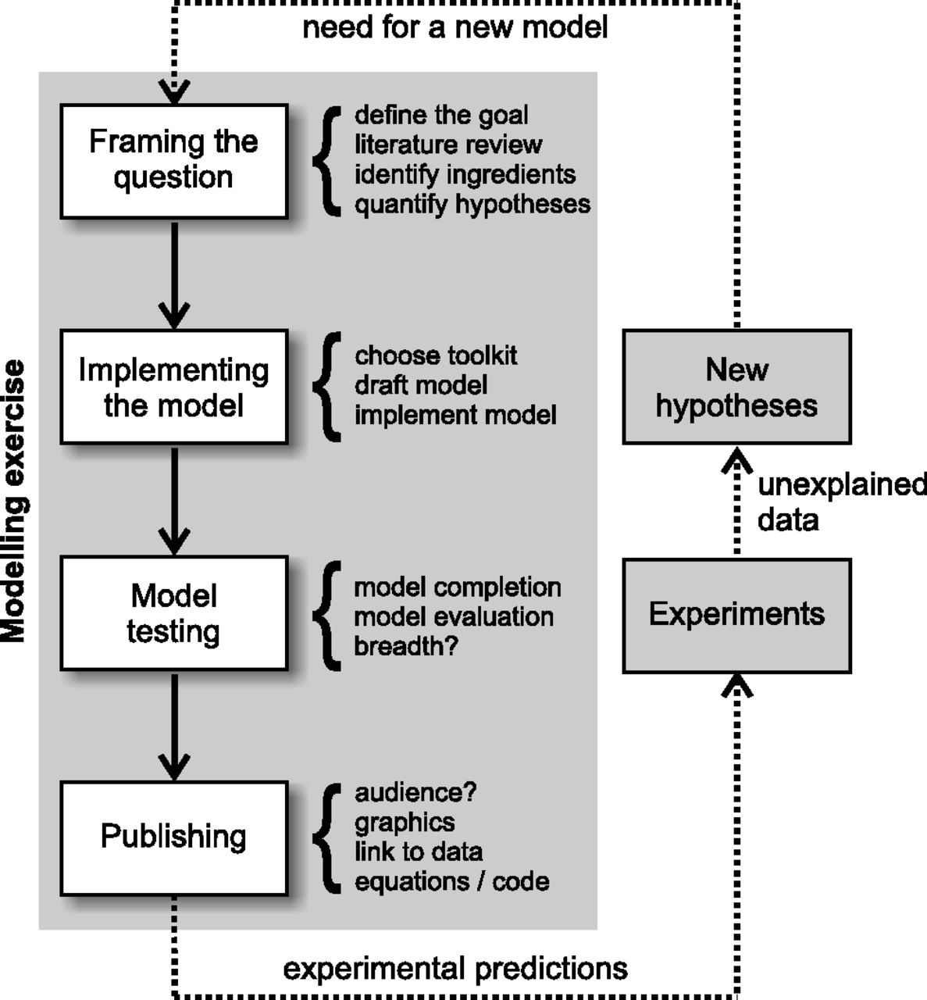
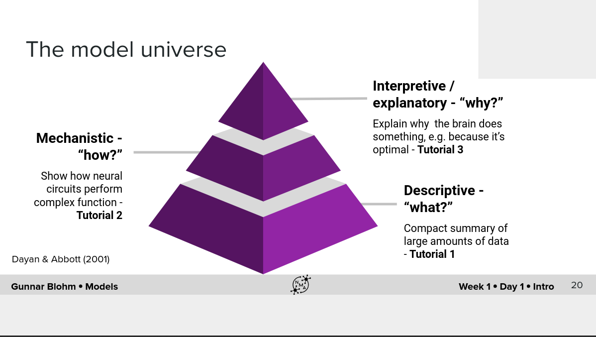
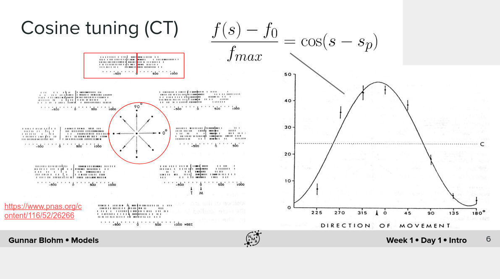
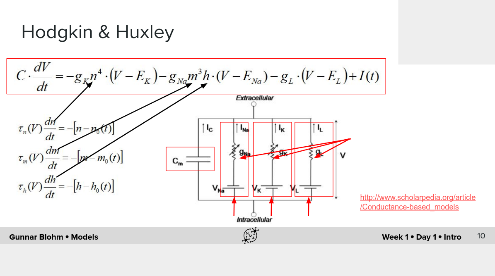
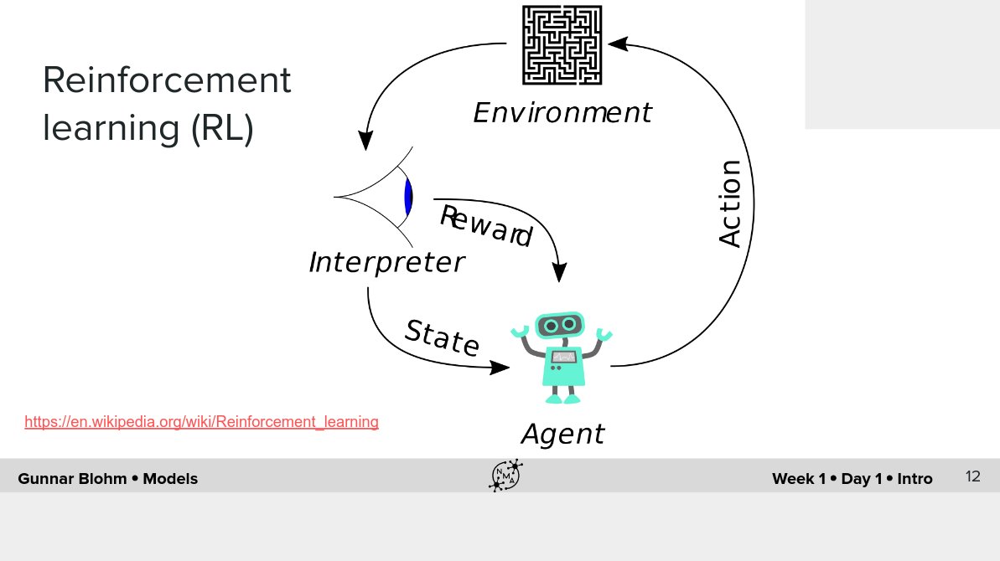
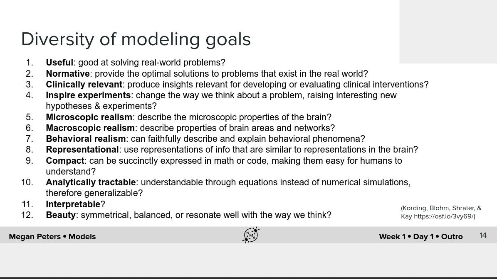

# A How-to-Model Guide for Neuroscience
Link: [https://www.eneuro.org/content/7/1/ENEURO.0352-19.2019](https://www.eneuro.org/content/7/1/ENEURO.0352-19.2019)
Authors: Gunnar Blohm, Konrad Kording, Paul Schrater

This paper talks about a step-by-step process of how-to-model in Neuroscience, but I feel this can be applied to other fields too.

The authors have use their observations from 8 years of conducting the CoSMo (summer school in Computational Sensory-Motor Neuroscience; [www.compneurosci.com/CoSMo](http://www.compneurosci.com/CoSMo))

# 10 Steps of modeling

This is divided into four sections - 

1. Framing the question
2. Implementing the model
3. Model testing
4. Publishing the model

    

      **Figure taken from the paper**

---

## Framing the question

### Step 1: Finding a phenomenon and a question to ask about it

- Build a list or a table of critical observations that define the interesting aspects of the
phenomenon - what sets it apart from other things or for which we lack good explanations
- Define a meaningful modeling question: What/Why/How question

**Figure taken from W1D1 slides of Neuromatch Academy**

Example of a "What" - 

**Figure taken from W1D1 slides of Neuromatch Academy**

Example of "How" -

**Figure taken from W1D1 slides of Neuromatch Academy**

Example of "Why" -

**Figure taken from W1D1 slides of Neuromatch Academy**

- Specify your goal:

**Figure taken from W1D1 slides of Neuromatch Academy**

- Ask precise questions. Imprecise questions lead to rapid failure.
- Identify the aspects of observations that the model will not address to answer the question
- Occam's razor - "entities should not be multiplied without necessity."
- “Know when to stop!” - A well defined modeling goal must have a well defined stopping criteria
- Determine precise evaluation criteria based on well defined qualitative and/or quantitative properties the model should exhibit. (More details further)

### Step 2: understanding the state of the art

- Do a literature review
- This would give you information about what kind of questions have already been addressed? What has already been done in terms of modeling? Are there previous models that one can use as a starting point?
- Insights on which evaluation criteria is typically used in the field
- Important to gain an intuitive and practical understanding of previous models - this can be done by re-implementing previous models and exploring their potential and limitations in a hands-on fashion
- Exploring strengths and weaknesses of previous models will help you justify a new model
- Literature review will also allow determination of skill set required

### Step 3: determining the basic ingredients

- What variables and/or parameters in the question and inventory are needed in the model? Are those constants or do they change over, for instance, space, time, or conditions? Are there any latent variables? If yes, how to measure them?
- What details can be omitted? What are the constraints, initial conditions? How are these variables expected to interact?
- What would be your inputs and outputs?
- Create a library of potential explanatory mechanisms - Such a library is usually collected over time by hands-on exploration of different models, approaches, pieces of math, and algorithms

### Step 4: formulating specific, mathematically defined
hypotheses

- We need to map our intuitions and proposals about mechanisms and variables into precise mathematical language
- The more precise the hypotheses, the better the modeling approach can be justified

Steps 1–4 are linear in an ideal case scenario, but often need to be conducted iteratively. Indeed, every step has the potential to unmask a weak, imprecise, already answered, not interesting, or too ambitious question.

---

## Implementing the model

### Step 5: selecting the toolkit

- What modeling tools should be used and what level of abstraction is appropriate?
- A good question to ask is how flexible the toolkit is in terms of behavior. There is no “right” tool, and often there is more than one option to choose from
- Toolkit selection supposes a good knowledge of what the strengths and limitations of each available toolkit are. Preference should be given to toolkits that have more flexibility and span a wider range of behaviors
- Choosing the toolkit also means determining how the model will be solved (i.e., simulated). For example, can an analytical solution be computed or is numerical integration of equations required?

### Step 6: planning the model

- We are now ready to start building up the model. This is the point where diagrams are drawn, sketches can be made, equations are formalized and preliminary pieces of code are written.
- The model should always be kept as simple as possible!
- Build/draw graphical representations of the model. Draw out the model components and how they connect to each other/influence one another.
- Now each model box, icon, or flow can be considered individually, and its internal workings should be drafted in terms of mathematical equations. These should be explicit equations that can later be implemented in simulation programs.
- These diagrams might be included further in the publication

## Step 7: implementing the model

- Implement and simulate the model
- Build up the model step by step and if possible test its function at each step
- We should plot model behaviour as a function of model parameters. We can analyze model stability/equilibrium points. We can ask how similar the model performs to known models (e.g., those that can be analytically solved)

---

## Model testing

### Step 8: completing the model

- One of the hardest questions in modeling is to decide when to stop improving the model and call it final.
- Does the model answer the original question sufficiently (i.e., with enough detail to advance knowledge in the field of study)? Equally importantly, does the model satisfy the evaluation criteria that have been determined prior to building the model? Does it speak to the hypotheses, either confirming or invalidating them?
- On the one hand, we can usually improve model fits; on the other hand, we do that at the risk of overfitting the data we have.
- Occam’s razor might help here to determine whether it is worth considering more complicated models with more parameters that are perhaps irrelevant or uninterpretable in order to obtain a better fit to the data. The cost of such more complicated models is always the reduced explanatory power.

### Step 9: testing and evaluating the model

- How to evaluate how well a model did supremely depends on the nature of the goals
- For example in Machine Learning tasks, criteria like mean squared error, accuracy on previously unseen (test) data can be reported
- Comparison with existing precursors/alternatives
- Finally, it is important to ask questions about generalizability. Will the model also adequately describe similar situations?

---

## Publishing

### Step 10: publishing models

- The introduction section should describe the phenomenon/question that the model addresses (Step 1), provide relevant background information from the literature review (Step 2) and maybe introduce some of the ingredients needed (Step 3) as well as general hypotheses (Step 4)
- Methods will detail all model ingredients (Step 3) and hypotheses (Step 4), justify the choice of the toolkit (Step 5) to answer the question asked and meet the goals
- The final graphical draft of the model (Step 6) typically becomes the first detailed figure implementation (Step 7) as well as the procedures of model testing and evaluation (Step 9), which will also be detailed in the Methods section
- Results will summarize model performance (Step 8) and provide the testing and evaluation statistics (Step 9) along with answering the original question (Step 1) and speaking to each of the specific and general hypotheses (Step 4)
- Some important guidelines -
    - Know the target audience. Write in a way that your audience can understand.
    - A model should always be graphically represented if at all possible.
    - Publish the model code. Clean up the code and make it readable and understandable to others. Ideally, the published code should reproduce all figures of the results in the article.
    - Publish the data that you fit your model to in one of the relevant databases
