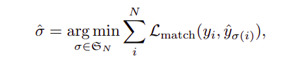
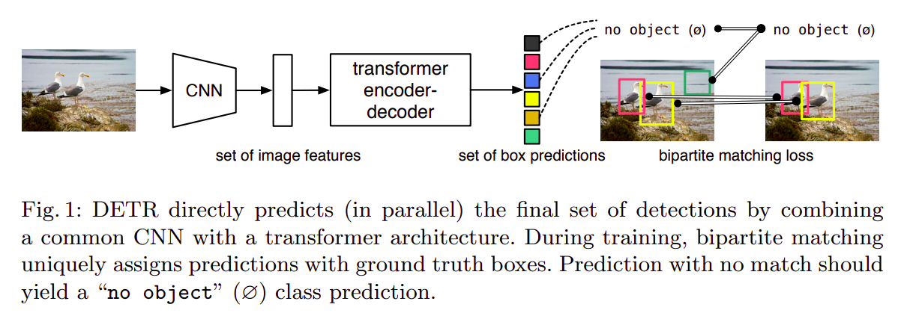
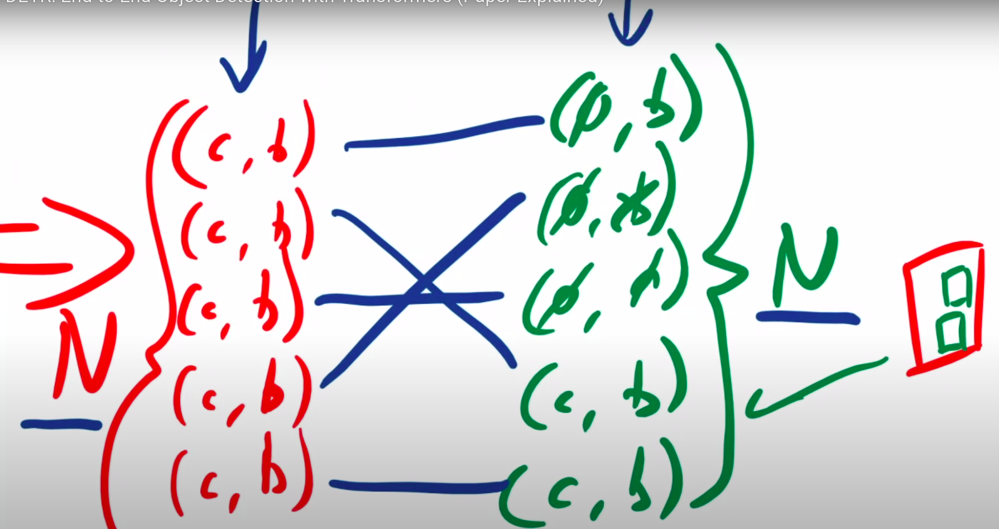
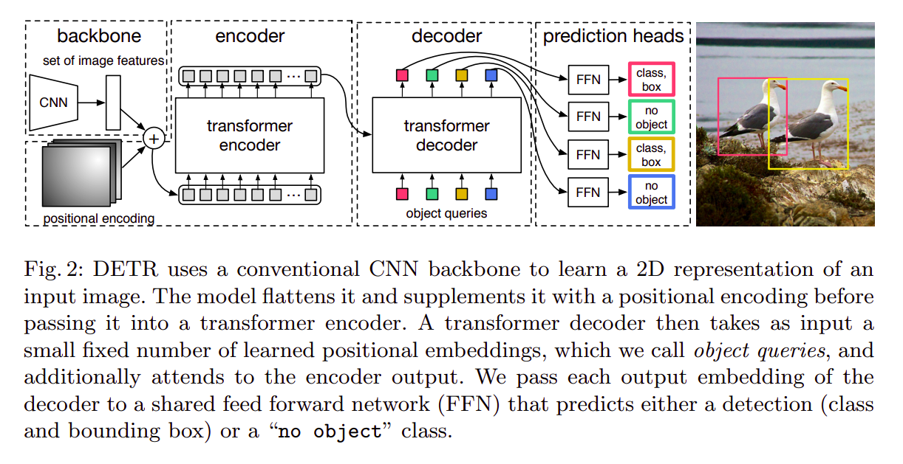
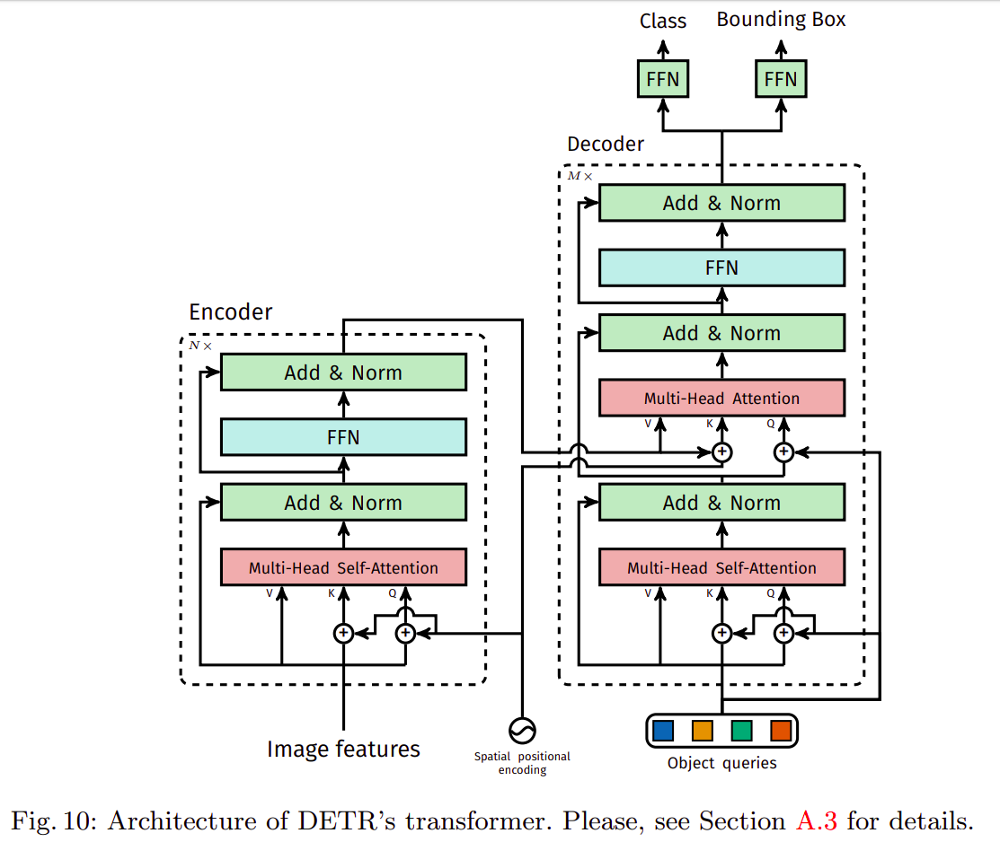
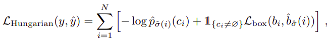
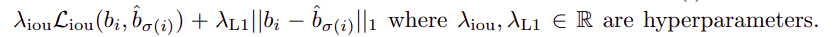
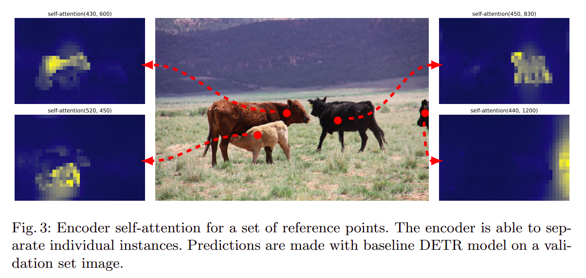
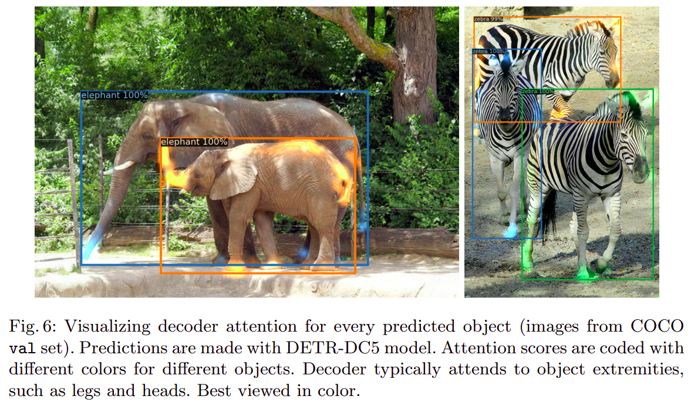
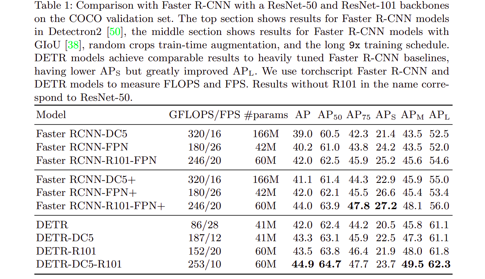

### *A new method that views object detection as a direct set prediction problem. The approach streamlines the detection pipeline, effectively removing the need for many hand-designed components like a non-maximum suppression procedure or anchor generation that explicitly encode our prior knowledge about the task. The main ingredients of the new framework, called DEtection TRansformer or DETR, are a set-based global loss that forces unique predictions via bipartite matching, and a transformer encoder-decoder architecture. Given a fixed small set of learned object queries, DETR reasons about the relations of the objects and the global image context to directly output the final set of predictions in parallel.  DETR demonstrates accuracy and run-time performance on par with the well-established and highly-optimized Faster RCNN baseline on the challenging COCO object detection dataset. 
Training code and pre-trained models are available at:
*

# About previous detectors:

Most of the current works including Faster RCNNs and YOLO consist of some post-processing techniques such as removing near duplicated with NMS (Non-Max suppression).

They also consist of initial pre-computation of anchor boxes.

DETR comes up with an alternative pipeline for object detecting removing the need for anchor boxes and non max suppression. 

# DETR Pipeline:

**Learning Objective :**

Here N denotes the total predictions that your model will make and is chosen to be a typically large value ( For example N=100 ).  

**Summary of pipeline:**

# Bipartite Matching:

# Hungarian algorithm:

Hungarian algorithm is used to solve the assignment problem. Suppose there are 3 potholes and 3 workers and we know the cost it takes for each worker to reach every pothole, what would be the best assignment such that the total cost is minimized? This can be solved with the Hungarian algorithm.

# Implementation details:

### **Loss function :**

where L_box is:

# Observations:

# Results:

### Concluding Remarks:

DETR doesn't perform as great as compared to Faster RCNN on smaller objects. However it performs better on larger objects.

Larger training time and computationally heavy.

Attention in object detection pipeline improves performance as can be looked at from the Non-Local neural networks example.

There are plenty of other drawbacks and a lot of room for improvement.
