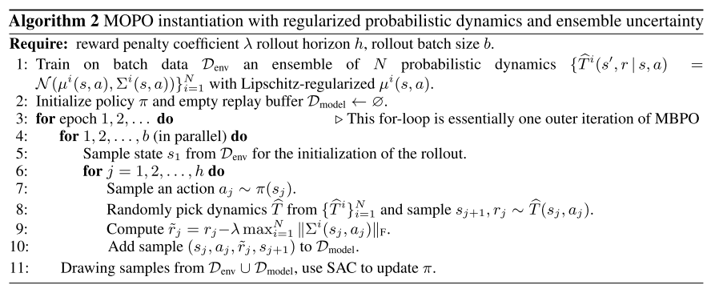
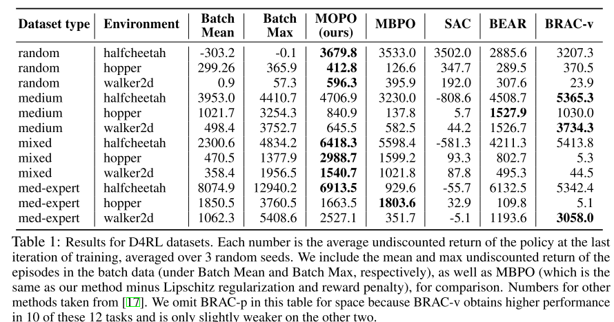
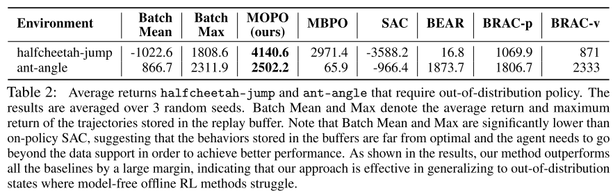

# MOPO: Model-based Offline Policy Optimization

*Tianhe Yu, Garrett Thomas, Lantao Yu, Stefano Ermon, James Zou, Sergey Levine, Chelsea Finn, Tengyu Ma*

[https://arxiv.org/pdf/2005.13239.pdf](https://arxiv.org/pdf/2005.13239.pdf)

# Problem:

- **Offline RL:** Regular RL methods need to improve with interaction. Not suitable for: generalization, safety, sample inefficient.
- **Off-policy algorithms:**
    - Model-free methods: Overestimation of Q function for out-of-distribution actions, Cannot generalise out of data's states and actions.
    - Model-based methods: More supervised (since s,a rather than r), supervised training rather than RL, better uncertainty estimation techniques than value-based RL. But here model cannot be improved with experience, so need to be careful on what model learns.

# Solution:

- Model where reward is penalized by model error (to account for model uncertainty). This is the MDP
- Train policy on this MDP using MBPO

# Details:

- Use model based because of earlier specified reasons and that MBPO performs better than SAC off the shelf on D4RL
- **MBPO**
    - Learns transition and reward distribution  (this is the model) from data
    - During training, use transition model to generate rollouts and save in replay buffer
    - Update policy using both model data and given data. (Like Behavioral Cloning, World models)
    - In online setting: Additionally use both model and environment to improve model and policy (Like Dyna)
- **MOPO**
    - Return: Should be able to generalize to OOD data. But Risk: model will become unreliable for OOD data and might overfit to unreliable model data. Need to balance these
    - Quantifying uncertainty: from dynamics to return
        - How does error in transition model affect error in return?
            - Note: Estimate true model using learned model. Estimate true return using return from model.
            - Lemma 1: Return depends on G (difference in values from both transition models). A model that gets high reward and minimizes G will maximize return on real model too. If we can get G, can use as upper bound for return.
            - Since V is unknown, replace with terms depending only on transition model. Options depend on assumptions we take.
                - If assume that reward is bounded can write Eq. 4 (Simpler assumption)
                - If assume V's are Lipschitz functions, can use Wasserstein distance and write Eq 5
    - Algorithm 1: With Eq 4. assumption.
        - Penalize reward by an amount proportional to model error (T error). From Eq. 2
        - Run till convergence: policy = argmax (estimated return).
    - Algorithm 2: With Eq. 5 assumption
        - This is final MOPO since Lipchitz regularization has been seen to improve in and out of distribution generalization.
        - Uncertainty is quantified using maximum standard deviation of model prediction from Lipchitz regularized mean.

    

# Results

- In distribution, for different dataset categories
    - random - random policy
    - medium - partial SAC then rollout
    - mixed - SAC then take replay buffer as dataset
    - medium-expert - combine fully trained policy with rollouts from either partial or random

- Out of distribution generalization
    - Cheetah-jump - Train on walk, test on jump
    - Ant-angle - Train on straight walk, test on 30 degree walk

# Future work

- Don't theoretically understand why model-based perform so much better on offline tasks. Find out why.
- Find how to get model-free offline methods up to the level of model-based.
