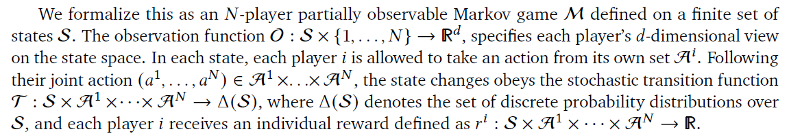

# Model free conventions in MARL with Heterogeneous preferences

By Koster et al 

link - [https://arxiv.org/pdf/2010.09054.pdf](https://arxiv.org/pdf/2010.09054.pdf)

## Key Takeaways -

- The Idea of convention - Coordinated idea for collective good in a setting where preferences differ from person to person
- A model free approach to establishing conventions - MF seems to be connected mostly with habits, MB to rational thinking. Mostly, conventions (such as treaties) are approached from a rational pov, this paper investigates the role of MF in convention forming
- How?? A temporo-spatially extended game, multiple agents, each having a different reward mapping, incomplete and imperfect information (some parts of the state space are reachable only through coordinated action)
- Problems to this approach - The startup(if not a critical mass of users, then the collective good policies can be overshadowed by others following their respective greedy policies) and free-rider problem(Greedily maximizing one's own objective, leaving the task of collective objective maximization to others in the population)

### What exactly are conventions -

- Societies usually comprise of people with largely different tastes and preferences, often conflicting. Even if a subset does have a common societal goal, they face a collective action problem. States that - **discovering a convention is a difficult problem of joint exploration**.
- The incentive structure in some cases might be such that learning is attracted to certain equilibrium points → Conventions
- Largely 2 classes of convention forming were considered before: (1) The rational way - Careful calculations and planning, reaching to good equilibria and (2) Emergent phenomena driven by evolutionary forces.
- Some fraction of real world phenomena are not well described the above 2 MB approaches.

Examples of MF conventions in real life?? - 

- New members in a band, rehearse till they achieve coordination before their performance
- You and I can row a boat together, even if we couldn't communicate at all

    These are insensitive to rapid evaluations - as in MF, if the conditions change, some amount of trial and error would be required to get to a new equilibrium point

### The model -

**A convention here is a problem of joint exploration and collective action**

**The game -** 

- Treated as a game of imperfect and incomplete information
    - Imperfect information - Each player has some private information that is not known to the adversary
    - Incomplete information - Rules of the game are not known to anyone, they need to play and discover them

Formally - 

**Heterogeneous preferences -** 

- K different berry colors, an agent prefers consuming any berry over no berry
- Taste - ranks the preferences of berries to the agent
    - Tastes are usually considered to be unconditional preferences: Assuming that they need not take others into account as opposed to conditional preferences: Taking a certain action expecting others to behave in a certain way
    - In games with conflicting preferences - conditional and unconditional preferences may diverge. In this paper - "A convention is achieved if the agent tries to maximize an objective than predicted from its taste alone"

Formally -

$G = {g_1, g_2,..., g_{|G|}}$ indicates the set of unique reward profiles such that $g(I_k(s_t, a_t)) = R^K_t$ , the reward to the Kth agent at the t-th time step

$\mu_E$ denote the distribution of states generated from playing out games where each agent implements its part of the equilibria

**Individual learning behavior -** 

Each agent follows a policy $\pi(a^i|o^i)$, based on its observation $o^i = O(s, i)$ and its reward $r^i(s, a^{i:1 to N})$. Each agents goal is to maximise the gamma discounted reward:

**Definition of convention -** 

The group produces a distribution of joint behavior. The degree of dissimilarity of this produced behavior to the expected behavior in a maximally uncoordinated state is called the **Degree of convention**

Formally - 

Assume a signature function \sigma(s) for a degree of conventionality for a population of N agents with reward profile set G, and a joint policy $\vec{\pi}$. Let $\mu_{\vec{\pi}, s_0}$ be the distribution of states following $\vec{\pi}$ and starting from $s_0$. The expected emperical signature would be 

Following a policy $\vec{\pi}_{TS}$ being the taste-seeking policy, the expirical signature obtained would be

The degree of conventionality then can be defined as - $C = M(\Sigma_{TS}, \Sigma)$, m being any measure to compare two distributions

What are the valid signature functions??

- Causally downstream from agent actions
- Insensitive to additional agents if the additional agents elect a free-riding strategy

A valid signature used in the paper is $\sigma(s) = (b_1(s), b_2(s),...b_K(s))$, where $b_K(s)$ = Number of K type berries / Total number of berries

### The GAME-

- Individuals are given rewards for eating ripe berries according to their reward profile $g$
- At the start - unripe berries distributed into K different colors
- Individuals can replant an unripe berry of any color.
- Individuals can **zap**, thereby temporarily removing everyone else from the game
- Unripe berries ripen with probability $P(ripen) = F(n_k)$. F is a monotonically increasing sharp function.

m(s) - monculture fraction

**Agent architectural details -** 

- A sprite is an 8x8 path, an agent recieves an 11x11 sprite (which is like an image patch) as an obs, the network produces a policy $\pi^i$ and estimate of $V^i_{\vec{\pi}}(s)$, trained using importance weighted policy updates sampled from a queue of trajs [Impala, Espenholt et al, 2018]
- Consisted of a visual encoder with 2 conv layers (16 and 32 channels), 2 fully connected layers (64, 64) and a 128 unit LSTM which finally mapped to the policy and value

Combinations tried out - 

**Monoculture states**

- The states $s^*_k$ for which m(s) =1, basically all berries are of 1 type. A pareto optimal state, since F(m(s)) is optimal, hence, total berry consumption is maximized.
- Selecting a different monoculture merely advantages a different group, shifting to non-monoculture disadvantages all
- Collective action is bookended by the startup and free-rider problems

**The Free rider problem -**

Considering the Setting 3 - Let $\mu_{\vec{\pi}}$ be the distribution of states following the policy $\vec{\pi}$, the expected monoculture fraction is $\bar{m} = \Sigma m(s)\mu_{\vec{\pi}}$ ****

- Policies that increase \bar{m} are only favored if the benefit to the individual by doing this is greater than cost of time invested planting
- Empirically, beyond a certain replicating rate, individuals are no longer motivated o contribute to the common good, regardless of whether G corresponds to the monoculture or not
- All would benefit from the emerging monoculture, but all would prefer to spend their own time planting and rely on others to put in the effort to increase the monoculture fraction beyond \bar{m}

**The start-up problem -** 

Occurs in Setting 4 and setting 2

- When |G| > 1, there is a certain disagreement between individuals as to which monoculture to prefer
- Effect on setting 4 is more than setting 2, as noticed empirically by more zapping and more replanting in setting 4 as compared to 2
- In such situations, the population can enter 2 regimes, one where no berry colour is spread far above the others, leading to low returns, and the second, tending towards the monoculture
- Increasing the initial number of individuals in one group is sufficient, but not a necessary condition to achieve the high reward state

**Long Term convention formation**

- Empirically, there are 2K+1 stable states:
    - The base conflict state, where m = 1/K
    - K incomplete monoculture states - overcome the startup problem but still suffering from the free-rider problem
    - K perfect monoculture states

Considering setting 4, with 4 groups consisting of 11(Red), 5, 4, 4 players respectively

Obs - 

- Initially each group learns to favor its own color - Red later becomes the primary support, green and yellow are kept as secondary support till the support for yellow decreases in favor of red
- Additionally, the overall amount of planting decreases, suggesting players overwrite the other players actions less as the convention forming progresses

### Discussion -

- Coordination was largely constrained by the startup and free rider problems. Increasing the population in one group can sometimes mitigate the startup problems, but the free rider problem still exists. How can we get rid of this?
