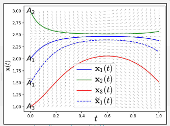

# Neural ODEs

[Neural Ordinary Differential Equations](https://arxiv.org/abs/1806.07366)

or rather — Training infinitesimally-layered neural networks by backpropagating through black-box ODE solvers!

### Overview of neural nets and resnets:

Neural nets can be thought of as universal function approximators and they perform a series of operations at each hidden layer inside the network and eventually to get the final output aka the prediction. In all the cases till now we think of the hidden layers to be discrete, for example -

```
h1 = f1(x)
h2 = f2(h1,w1)
h3 = f3(h2,w2)
h4 = f3(h3,w3)
y  = f5(h4,w4)
```

And then we have ResNets, where instead of passing the output of the previous layer as input to the current layer, we'll also add the input of the previous layer to it and pass it as input to the current layer, causing these kinds of skip connections as you may see. Thus instead of learning the whole new layers and causing the gradients to diminish, it's easier to just learn a residual mapping instead i.e. just the change between the previous and the current layer. This would look something like -

```
h1 = f1(x) + x
h2 = f2(h1,w1) + h1
h3 = f3(h2,w2) + h2
h4 = f4(h3,w3) + h3
y  = f5(h4,w4) + h4
```

### Overview of differential equation solvers:

An usual ordinary differential equation would look like-

$$d x(t)/dt = f(x(t),t, \theta)$$

where x is the variable of interest, t is *usually* time, f is a function of x, and t, it is the differential and is optionally parameterized by theta (a set of parameters).

What does it mean to solve a differential equation?

Usually framed as an Initial value problem and then solved using numerical integration methods, such as Euler method or Runge Kutta 4/5 or even adaptive solvers.

The Euler method: (where h is the step size)

$$t_{n+1} = t_{n} + h $$

$$x(t_{n+1}) = x(t_{n}) + hf(x(t_{n}),t_{n}) $$

A point to note, **Fundamental theorem of ODEs**
Geometrically, x(t) is a flow!  Which means say we rollout the trajectories over time [0,1] with different initial conditions, the trajectories will not intersect.



Example of a flow, ([source](https://openreview.net/pdf?id=B1e9Y2NYvS))

### Bridging differential equations and neural nets:

A few research groups noticed the similarity between this and the update step in Euler's method which is a numerical method to solve ODE. Now if a hidden layer looks like ht+1 = ht + f(ht, wt) what will happen if increase the layers and take smaller and smaller steps? Taking this idea to the logical extreme, in the limit, we can write the hidden layers as continuous ODE. **ResNet referred to residual changes in 2 consecutive hidden layers in space, ODEnet refers to the residual change in a hidden layer before and after time delta_t.** So now one can think of 

Excuse the small change in notation, here is comparative figure: Here, f is now a neural network and theta are the weights of the network.


ODEs vs ResNets ([source](https://voletiv.github.io/docs/presentations/20200710_Mila_Neural_ODEs_tutorial_Vikram_Voleti.pdf))

So how do we compute the gradients of the loss with respect to parameters for an ODEsolver? a straightforward way is to just save the "activations" x(t) at each step (now step here means in terms of your step size of the solver) and then just backpropagate through the ODEsolver. — This takes up a lot of memory!

Can we do better? Yes. — The Adjoint method - let's take advantage of an adjoint relation, the adjoint also follows an ODE. 


Overview of the Adjoint method ([source](https://voletiv.github.io/docs/presentations/20200710_Mila_Neural_ODEs_tutorial_Vikram_Voleti.pdf))

During forward propagation, get the x(t1) and a(t1), don't save the activations x(t) for values between t0 and t1. During backward propagation, get x(t0) and a(t0) in order to get the gradients of the loss with respect to parameters of the ODEnet.

Thus, you can also think of these as continuous time RNNs!

### Applications:

- Supervised learning
- Continuous Normalizing Flows
- Generative Latent models

Use as a invertible normalizing flow:


Use for time series prediction applications, generative latent models: Latent ODE

Idea: Encoder outputs the initial condition for the Neural ODE, Decoder uses a neural ODE to learn the underlying dynamics and not only reconstruct the observed time series but also extrapolate the time series to unobserved time steps.


And this idea can also be further extended to irregularly sampled time series, by replacing the RNN in the encoder with an ODE rollout whenever the time series is sparsely sampled


Latent ODEs for Irregularly-Sampled Time Series(Rubanova et al., NeurIPS 2019) 

### A glimpse of the latest research:

- FFJORD: Free-form Continuous Dynamics For Scalable Reversible Generative Models (Grathwohl et al., ICLR 2019)
    - Essentially a better Continuous Normalizing Flow.

    

- Augmented Neural ODEs (Dupont et al., NeurIPS 2019)
    - Shows that Neural ODEs cannot model non-homeomorphisms (non-flows) and augments the state by adding more dimensions to cover that.

    

- ANODEV2: A Coupled Neural ODE Evolution Framework (Zhang et al., NeurIPS 2019)
    - Neural net parameters also vary with time and are a function of time.

    

- Generative ODE Modeling with Known Unknowns (Linial and Shalit, ICLR 2020)
    - Replaces the neural net (as the differential) by an actual ODE whose initial conditions and parameters are learnt and governs the dynamics.

    

And finally, [this](https://www.youtube.com/watch?v=YZ-_E7A3V2w) summarizes what went right and wrong while publishing the Neural ODE paper 😂 

Thank you!