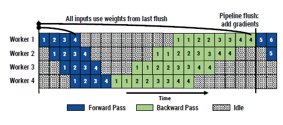
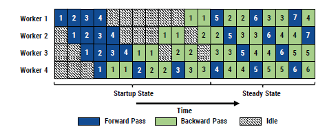
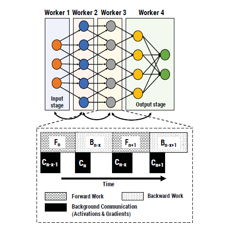

# PipeDream: Generalized Pipeline Parallelism for DNN Training 

## Key Takeaways: 

* The paper proposes pipeline parallelism: A combination of data and model parallelism with pipelining. Like model parallelism it partitions DNN and assigns subset of layers to each worker. But by using pipelining, it makes sure the workers concurrently working at any given moment of time. 
* It addresses the current problems in distributed training:  (1) high communication overhead & (2) low resource utilization 
* Their approach also overlaps communication of activations and gradients with the backward pass of another minibatch. 
* Authors compare their approach with GPipe’s inter-batch parallelism approach which has increased idle time. The 1F1B approach reduces idle time and thus improves resource utilization. 
* The partitioning of work amongst different workers is done in a way to reduce the communication overhead by framing it as a Dynamic Programming (DP) problem with suitable assumptions. Partitioning of work comprises of (1) a partitioning of layers into stages, (2) the replication factor (number of workers) for each stage, and (3) optimal number of minibatches to keep the training pipeline busy. 
* Replicating the number of workers for a stage is same as doing the training of the subset of layers assigned to that stage using data parallelism. The 1F1B needs to slightly change in order to do so. 
* For learning, the backward pass needs to perform on the correct weights, on which the forward pass took place. Thus authors, use weight stashing to store the weights. At most the number of distinct model weights required to be stashed at a worker is the number of stages in the pipeline. 

### Schematic representation of the GPipe’s approach:

### Schematic representation of the PipeDream approach:

### Schematic representation explaining model parallelism with pipeline parallel assignment of workers:

## Relevant notes:

* There is no theoretical proof for that this will work, the paper's arguments are empirical in nature. 
* Will this method scale to more number of workers? They don't exceed the memory constraints in their work, but the partitioning given by their DP algorithm doesn't exceed 16 workers. Weight stashing might become infeasible if the number of workers increase by a factor of 10. That could be another reason why in hybrid methods, model parallelism is used inside a node and data parallelism across nodes and not the other way round. 
* Figure 12, is counter intuitive. Why the communication overheads for data parallelism with mixed precision are higher than with full precision? 
* Extending this to the Async SGD implementation, the overlap can be extended to not just with the backward pass but other steps as well. 
