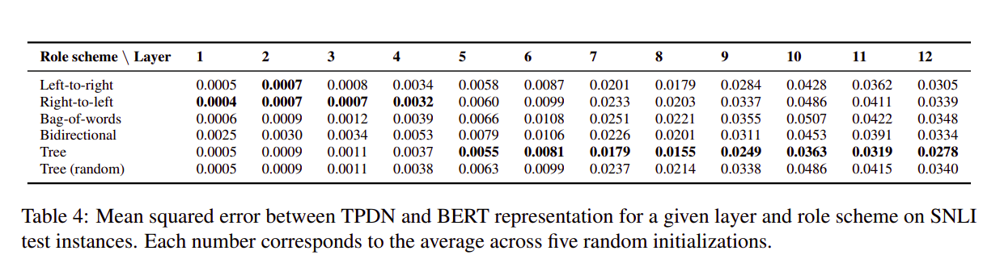

# Syntax and Structure in NLP

# Overview

---

1. Syntax in NLP
2. LSTMs and Syntax [(Linzen et al. 2016, TACL)](https://transacl.org/ojs/index.php/tacl/article/view/972)
3. Probing  word representations [(Hewitt & Manning 2019, EMNLP)](https://nlp.stanford.edu//~johnhew//interpreting-probes.html)
4. BERTology [(Jawahar et al. 2019, ACL)](https://www.aclweb.org/anthology/P19-1356/#:~:text=The%20intermediate%20layers%20of%20BERT,handle%20long%2Dterm%20dependency%20problem.)

# Syntax in NLP

---

**Syntax** refers to the rules and grammar of the language whereas the **Semantics** refer to the meanings assigned with the units of the language. In Computational Linguistics, Syntax follows a hierarchical structure.

**Ex:** Words > Phrases > Clauses > Sentences > Paragraphs ...

In NLP we use **Dependency Grammar** to get tree-like representations of the syntax at sentence-level. The dependency-tree represents words of a sentence connected to each other with some kind of **"relation"**. The superior word in the tree is called the **"governor"** and the inferior word in the tree is called the **"dependent"**. The top-most governing word in the sentence/phrase is called the **"head"** or the **"ROOT"** of that particular sentence/phrase.


Example Dependency Parsed Tree. {N: Noun, V: Verb, D: Determiner, A: Adjective, NP: Noun Phrase}

As far as deep learning is concerned, we have the following ways to deal with tree-like structures:

1. **Recursive Neural Networks** (Earlier)
2. **Graph Neural Networks** (More Recent)

But the most commonly used NLP models are still sequential in nature!

# LSTMs and Syntax

---

1. Recurrent NNs are intuitively good with sequential patterns (maybe good for semantics) (can capture things like n-gram co-occurrence) 
2. It needs to be inspected if Recurrent NNs can learn knowledge which is hierarchical in nature (like the syntax dependencies in natural language)
3. [(Linzen et al. 2016, TACL)](https://transacl.org/ojs/index.php/tacl/article/view/972) was one of the earliest thorough work which inspected the ability of Recurrent NNs to capture such syntax-sensitive dependencies.

(##Assessing-the-Ability-of-LSTMs-to-Learn-Syntax-Sensitive-Dependencies-(Tal-Linzen,-Emmanuel-Dupoux,-Yoav-Goldberg)

---

The goal of this work was to probe the ability of LSTMs to learn natural language hierarchical (syntactic) structures from a corpus without syntactic
annotations (sentences from Wikipedia)

### Subject-Verb Agreement Task

- The form of an English third-person present tense verb depends on whether the head of the syntactic subject is plural or singular.


- Sequential Recurrent NNs like LSTMs will find a huge distance (3 words apart) between the Subject (governor) and the Verb (dependent) here.
- Whereas, a hierarchical structure as shown above will have the Subject & Verbs as immediate neighbors, connected with a direct edge.

- **Number Prediction Sub-Task:**
    - Binary Classification (Singular vs Plural)
    - The Word-Embeddings are initialized with one-hot encoding over the corpus vocabulary
    - Give the sentence up to the word before the verb under consideration as an input to the model. Ex: **The keys to the cabinet <SIN/PLU?>** (**are** on the table)

    

- **Verb Inflection Sub-Task:**
    - Same as that of the number prediction task
    - Here, the Verb is included in the input sentence in its Singular Form
    - Thus, the model has access to the semantics of the verb in this case
    - This objective is similar to the task that humans face during language production: after the speaker has decided to use a particular verb (e.g., write), he or she needs to decide whether its form will be 'write' or 'writes'.

- **Grammaticality Judgement Sub-Task:**
    - The previous sub-tasks explicitly indicate the location in the sentence in which a verb can appear, giving the network a cue to
    syntactic clause boundaries
    - Here, the network is given a complete sentence and is asked to judge whether or not it is grammatical.

- **Language Modeling Sub-Task:**
    - Similar to the number prediction sub-task
    - Here, the network is a pre-trained LSTM based language model (GoogleLM)
    - The binary-classification is done by comparing probabilities assigned to the singular and plural verb forms by the LM.
    - Overall, they found that LM perform poorly as compared to directly supervised LSTMs.

    Overall, this work not only explored the ability of Recurrent NNs to perform syntax related tasks in NLP but also gave a base for the then-upcoming probing and structure related tasks in NLP, which would ultimately bring up research topics like BERTology and Computational Psycholinguistics in NLP.

# Probing Word Representations

- Earlier ML methods for NLP used various **linguistic features** like POS tags, dependencies, frequency metrics, etc
- These were well known and **interpretable** in nature
- Recently, these have been replaced with  **Word Representations** from large pre-trained **language models**
- These perform better than traditional linguistic features, but are less interpretable
- We use a probe to interpret the hidden linguistic knowledge in these black-boxed  word representations

## Designing and Interpreting Probes with Control Tasks (John Hewitt & Percy Liang)


- A probe can by any kind of task-specific model.
- Usually people use single layered NN as a probe

The problems with probing:

1. How strong and complex should your probe be to inspect a particular linguistic property in your word representations?
2. How much training data should you use while probing? (with enough data your probe would just memorize everything and give good results)
3. The performance from the probing task, is it due to the hidden knowledge from the word representations or did your probe learn the knowledge pattern itself?

The most naive approach to handle these problems is to train the probe on random inputs and check probe's standalone capacity to learn the linguistic property. But to handle these problems efficiently, one can define "Selectivity" of the probe to monitor the linguistic properties of word representations in a better way. 

```python
                selectivity = linguistic acc − control acc
```

Selectivity puts linguistic task accuracy in the context of the probe's ability to memorize arbitrary outputs for word types. 

# BERTology

- This, in general, refers to the research topic which deals with probing and inspecting language-models for their abilities and properties
- BERT has 12 layers, where the deeper layers perform the best (usually) SOTA on downstream tasks with fine-tuning (as expected)
- But this does not mean that BERT learns the language completely, neither does it mean that most of the knowledge it has learned about the language is in its deeper layers

## What Does BERT Learn about the Structure of Language? (Ganesh Jawahar, Benoît Sagot, Djamé Seddah)

- Jawahar et al. (2019) have probed the BERT layers for various tasks to check its knowledge about the syntax and structure of language
- Their work was parallel to that of Yoav Goldberg and Tal Linzen
- Such papers  made Hugging Face add BERTology specific features in their library

- **Phrasal Information:**


- **Probing Results:**


1. SentLen: Length of sentence
2. WC: Word occurrence detection
3. Treedepth: What is the depth of dependency tree
4. TopConst: Sequence of top level constituents in the syntax tree
5. BShift: Word Order detection
6. Tense: Tense of the sentence
7. SubjNum: Subject number in the main clause
8. ObjNum: Object number in the main clause
9. SOMO: Sensitivity to random replacement of noun/verb 
10. CoordInv: Sensitivity to random swapping of coordinated clausal conjuncts

- **Subject-Verb Agreement:**


- **Compositional Structure:**



## Concluding Thoughts:

1. What do the current language models learn?
2. How do the current language models learn?
3. How is it different from human language learning?
4. Must read paper: **How Can We Accelerate Progress Towards Human-like Linguistic Generalization? [(T. Linzen; ACL 2020)](https://arxiv.org/abs/2005.00955)**
